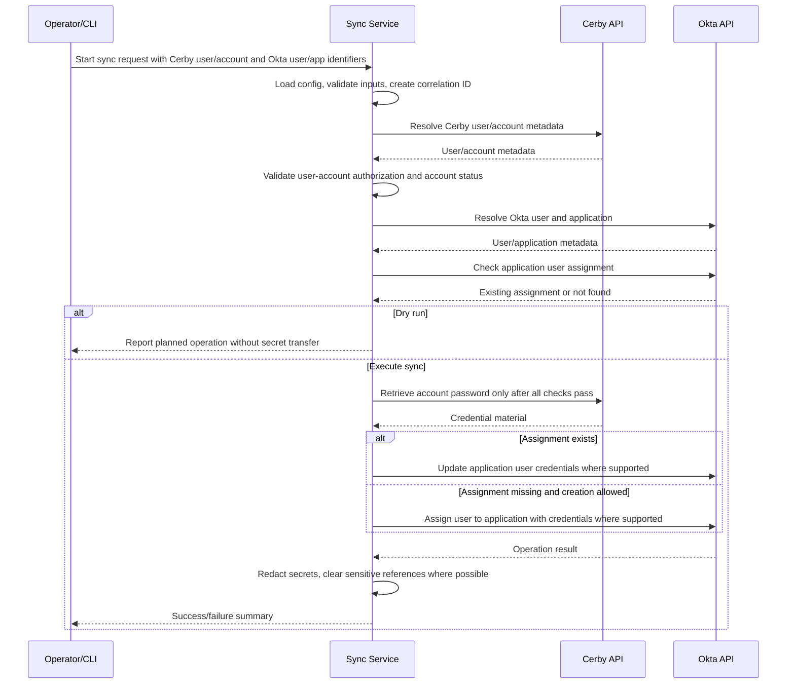

# GitHub Copilot Prompt: Cerby-to-Okta Credential Synchronization Implementation

## Role
Act as a senior identity engineering and secure software development assistant. Help design, implement, test, and document a production-ready service that synchronizes credentials for a given user from a Cerby tenant into an Okta tenant using the official Cerby and Okta APIs.

## Primary Objective
Build software that can securely read credential data associated with a specific user/account from Cerby and synchronize it to the corresponding Okta application user assignment in an Okta tenant.

The implementation must include complete technical documentation covering architecture, configuration, API flows, security controls, operational behavior, testing, deployment, and troubleshooting.

## Source Documentation
Use these official references as the primary API documentation sources:

- [Cerby Accounts API documentation](https://developer.cerby.com/#accounts)
- [Okta Applications API documentation](https://developer.okta.com/docs/api/openapi/okta-management/management/tags/application)
- [Okta Core API reference](https://developer.okta.com/docs/reference/core-okta-api/)
- [Okta Application Users API documentation](https://developer.okta.com/docs/api/openapi/okta-management/management/tags/applicationusers)

Before writing code, inspect the current repository and align with its existing language, framework, package manager, linting, testing style, configuration conventions, and folder structure. If no stack exists, assume TypeScript on Node.js 20+ with a modular service architecture.

## Business Goal
Enable controlled, auditable synchronization of application credentials managed in Cerby into Okta app assignments for a specific user, reducing manual credential handling while preserving least privilege, traceability, and secure secret management.

## Functional Scope
Implement a service or CLI workflow that supports the following high-level operation:

```text
sync-credentials --cerby-user <cerbyUserIdOrEmail> --cerby-account <cerbyAccountIdOrLabel> --okta-user <oktaUserIdOrLogin> --okta-app <oktaAppIdOrLabel>
```

The workflow must:

1. Load configuration from environment variables and/or a secure configuration provider.
2. Validate all required inputs before making API calls.
3. Authenticate to Cerby using the Cerby API token.
4. Locate or retrieve the Cerby user and/or account.
5. Verify the Cerby account belongs to, is shared with, or is otherwise authorized for the requested Cerby user.
6. Retrieve the credential material from Cerby only when needed.
7. Authenticate to Okta using an Okta API token or scoped OAuth access token, depending on repository standards and available credentials.
8. Locate the Okta user.
9. Locate the Okta application.
10. Check whether the Okta user is already assigned to the target Okta application.
11. If the assignment exists, update the application user credentials where supported by the Okta app/authentication scheme.
12. If the assignment does not exist, assign the user to the application with credentials where supported.
13. Return a clear success/failure result without printing secrets.
14. Record audit logs with correlation IDs, API request IDs where available, non-sensitive identifiers, timestamps, and operation status.

## Important API Notes to Respect

### Cerby
- Cerby API base URL pattern: `https://{CERBY_WORKSPACE}.cerby.com/api/v1/`.
- Use the `X-API-Key` request header for Cerby API authentication.
- Use Cerby account/user APIs to list, retrieve, and validate the relevant user/account relationship.
- Use the account password retrieval endpoint only after authorization and validation checks pass.
- Treat any retrieved password, TOTP code, backup code, token, or secret as highly sensitive.
- Do not log Cerby credential values.
- Handle Cerby pagination, filtering, 401, 403, 404, 409, and 429 responses.

### Okta
- Okta API base URL pattern: `https://{OKTA_DOMAIN}`.
- Use documented Okta Management API endpoints only.
- Support either:
  - API token authentication using `Authorization: SSWS <token>`, or
  - OAuth 2.0 scoped access token authentication using `Authorization: Bearer <token>`.
- Prefer scoped OAuth tokens if the repository or environment already supports them.
- Use the Users API to resolve Okta users by ID or login.
- Use the Applications API to resolve Okta applications by ID or label.
- Use the Application Users API to list, assign, or update app user assignments.
- Use Okta pagination via `Link` headers and cursor values; do not manually construct next-page cursors.
- Capture `X-Okta-Request-Id` in logs for troubleshooting.
- Handle Okta 400, 401, 403, 404, 409, 411, 429, and 5xx responses.
- Do not assume every Okta application supports password credential assignment. Detect unsupported app sign-on modes or credential schemes and fail safely with an actionable message.

## Configuration Requirements
Use environment variables or the repository’s existing secure configuration mechanism. Do not hard-code secrets.

Minimum configuration:

```bash
CERBY_WORKSPACE=example-workspace
CERBY_API_TOKEN=***
OKTA_DOMAIN=example.okta.com
OKTA_AUTH_MODE=SSWS # or OAUTH2
OKTA_API_TOKEN=*** # required when OKTA_AUTH_MODE=SSWS
OKTA_OAUTH_ACCESS_TOKEN=*** # required when OKTA_AUTH_MODE=OAUTH2
LOG_LEVEL=info
DRY_RUN=false
HTTP_TIMEOUT_MS=30000
MAX_RETRIES=3
```

Optional configuration:

```bash
SYNC_REQUIRE_EXPLICIT_USER_ACCOUNT_MATCH=true
SYNC_ALLOW_CREATE_OKTA_ASSIGNMENT=true
SYNC_ALLOW_UPDATE_OKTA_ASSIGNMENT=true
SYNC_REDACTED_LOGGING=true
SYNC_CORRELATION_ID_HEADER=X-Correlation-Id
```

## Security Requirements
Implement the solution with a security-first design:

1. Never log, print, persist, or expose raw credentials.
2. Redact secrets from errors, traces, request/response dumps, and test snapshots.
3. Keep credentials in memory only for the minimum necessary time.
4. Avoid writing secrets to disk, caches, telemetry, or debug logs.
5. Use TLS-only API communication.
6. Validate all user-provided identifiers and reject malformed values.
7. Implement least-privilege token guidance in documentation:
   - Cerby token scopes should be limited to the required account/user read operations and password retrieval capability.
   - Okta token/scopes should be limited to required user/app/application-user operations.
8. Include rate-limit handling with bounded retries and exponential backoff with jitter.
9. Include idempotency safeguards so repeated runs do not create duplicate assignments or cause unnecessary password updates.
10. Include a dry-run mode that validates mappings and permissions without retrieving or writing credentials when possible.
11. Include structured audit logging that is useful for investigation but safe for secret handling.
12. Include clear failure modes for authorization errors, unsupported Okta apps, missing users, missing accounts, ambiguous matches, and rate limits.
13. Include dependency hygiene guidance and avoid unnecessary third-party packages.
14. Include unit and integration tests that verify secrets are never logged.

## Suggested Architecture
Create or adapt modules similar to the following, using the repository’s actual conventions:

```text
src/
  config/
    loadConfig.*
    validateConfig.*
  clients/
    cerbyClient.*
    oktaClient.*
    httpClient.*
  domain/
    credentialSyncService.*
    mappingResolver.*
    authorizationValidator.*
  cli/
    syncCredentialsCommand.*
  logging/
    logger.*
    redaction.*
  errors/
    apiErrors.*
    domainErrors.*
  tests/
    unit/
    integration/
    fixtures/
docs/
  cerby-okta-credential-sync.md
```

If the repository uses a different architecture, adapt this plan to fit the existing patterns.

## Core Data Flow
Document and implement this flow:



## Implementation Details
When implementing code, include:

### HTTP Client
- Centralized request helper with:
  - Base URL handling
  - Timeout
  - Retries for transient failures and 429 responses
  - Backoff with jitter
  - Safe error normalization
  - Header injection
  - Correlation ID propagation
  - Response parsing
  - Pagination helpers

### Cerby Client
Implement methods such as:

```text
listUsers(query?)
getUser(userId)
listAccounts(filters?)
getAccount(accountId)
listAccountsForUser(userId)
getAccountPassword(accountId)
getAccountTotpCode(accountId) // optional; only if required and explicitly enabled
```

### Okta Client
Implement methods such as:

```text
getUser(userIdOrLogin)
listUsers(searchOrFilter)
listApplications(queryOrFilter)
getApplication(appId)
listApplicationUsers(appId, query?)
getApplicationUser(appId, userId)
assignUserToApplication(appId, payload)
updateApplicationUser(appId, userId, payload)
```

### Credential Mapping
Implement a clear mapping model:

```json
{
  "cerby": {
    "workspace": "example-workspace",
    "userIdOrEmail": "user@example.com",
    "accountIdOrLabel": "account-id-or-label"
  },
  "okta": {
    "domain": "example.okta.com",
    "userIdOrLogin": "user@example.com",
    "appIdOrLabel": "0oa..."
  },
  "options": {
    "dryRun": false,
    "allowCreateAssignment": true,
    "allowUpdateAssignment": true
  }
}
```

Use explicit identifiers where possible. If labels or email-based lookup are supported, handle ambiguity by failing safely and asking the operator to provide an exact ID.

### Okta Assignment Payload
Use the Okta Application Users API payload shape supported by the app. For app credential synchronization, the payload may include fields similar to:

```json
{
  "id": "OKTA_USER_ID",
  "scope": "USER",
  "credentials": {
    "userName": "app-user-name",
    "password": {
      "value": "REDACTED_AT_LOGGING_LAYER"
    }
  },
  "profile": {}
}
```

Important: Do not assume this payload works for every Okta application. Validate the application sign-on mode, credentials scheme, and API error responses. If credentials are not supported for the app, return a clear safe failure.

## Documentation Deliverable
Create or update `docs/cerby-okta-credential-sync.md` with complete implementation documentation.

The documentation must include:

1. Executive summary
2. Scope and non-goals
3. Assumptions and open decisions
4. Architecture overview
5. Component diagram
6. Sequence diagram
7. Configuration reference
8. Required Cerby token permissions/scopes
9. Required Okta token permissions/scopes
10. API endpoint inventory
11. Request/response examples with secrets redacted
12. Credential mapping strategy
13. Dry-run behavior
14. Error handling strategy
15. Rate-limit and retry strategy
16. Logging and audit strategy
17. Secret handling and redaction strategy
18. Idempotency rules
19. Testing strategy
20. Deployment instructions
21. Operational runbook
22. Troubleshooting guide
23. Security review checklist
24. Known limitations
25. Future enhancements

## Testing Requirements
Add tests according to the repository’s conventions.

Minimum tests:

### Unit Tests
- Config validation succeeds/fails correctly.
- Cerby client builds correct URLs and headers.
- Okta client builds correct URLs and authorization headers.
- Pagination helpers follow documented pagination behavior.
- Retry logic handles 429 and transient 5xx errors.
- Mapping resolver rejects ambiguous matches.
- Authorization validator rejects unauthorized Cerby user/account relationships.
- Redaction logic removes passwords, API tokens, authorization headers, TOTP codes, and secret values from logs/errors.
- Dry-run mode does not retrieve passwords or update Okta.

### Integration/Contract Tests
Use mocks or a local HTTP test server unless the repository already has a safe integration-test strategy.

Test scenarios:
- Successful existing Okta assignment update.
- Successful new Okta assignment creation.
- Cerby account not found.
- Cerby user not authorized for account.
- Cerby password retrieval unauthorized.
- Okta user not found.
- Okta app not found.
- Okta app credentials unsupported.
- Okta rate limit response.
- Network timeout.
- Token expired/invalid.

## Acceptance Criteria
The work is complete when:

1. The service/CLI can run in dry-run mode and report the planned sync without exposing secrets.
2. The service/CLI can sync one Cerby account credential to one Okta app user assignment when both APIs allow the operation.
3. Existing Okta app user assignments are updated instead of duplicated.
4. Missing Okta app assignments are created only when explicitly allowed.
5. Unsupported Okta app credential schemes fail safely with an actionable error.
6. All logs and errors redact secrets.
7. Tests cover success, failure, retry, redaction, and dry-run paths.
8. Full implementation documentation exists in `docs/cerby-okta-credential-sync.md`.
9. The README or operational guide explains required environment variables and safe execution.
10. No secrets are committed to the repository.
11. Linting, formatting, type checking, and tests pass.

## Response Format Expected from Copilot
When responding, produce:

1. A brief implementation plan.
2. A list of files to create or modify.
3. The code changes, organized by file.
4. Tests, organized by file.
5. The documentation file content.
6. Security considerations and tradeoffs.
7. Manual validation steps.
8. Any assumptions or open questions that remain.

## Constraints
- Do not use undocumented Okta endpoints.
- Do not store credential values in application logs, persistent storage, telemetry, crash reports, or test fixtures.
- Do not print secrets to stdout/stderr.
- Do not implement browser-based scraping or UI automation.
- Do not bypass MFA, access controls, Cerby RBAC, Okta policies, or application-level security restrictions.
- Do not assume TOTP synchronization is required unless explicitly requested; if implemented, make it opt-in and document the security implications.
- Do not create broad admin tokens in examples; show placeholders only.

## Useful Operator Examples

Dry run:

```bash
sync-credentials \
  --cerby-user user@example.com \
  --cerby-account 46b5b821-76b5-1234-ba43-003fc8d4ca31 \
  --okta-user user@example.com \
  --okta-app 0oafxqCAJWWGELFTYASJ \
  --dry-run
```

Execute sync:

```bash
sync-credentials \
  --cerby-user user@example.com \
  --cerby-account 46b5b821-76b5-1234-ba43-003fc8d4ca31 \
  --okta-user user@example.com \
  --okta-app 0oafxqCAJWWGELFTYASJ
```

Expected safe output:

```json
{
  "status": "success",
  "operation": "okta_application_user_credentials_updated",
  "cerbyAccountId": "46b5b821-76b5-1234-ba43-003fc8d4ca31",
  "oktaUserId": "00u...",
  "oktaAppId": "0oa...",
  "correlationId": "...",
  "secretsExposed": false
}
```

## Final Instruction
Implement this as production-ready code and documentation. Prefer small, testable modules. Preserve existing repository conventions. If any API behavior is uncertain, document the uncertainty, add a safe guardrail in code, and avoid making destructive changes.
