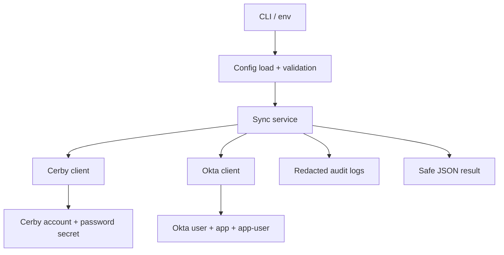

# Cerby to Okta Credential Sync

## 1. Executive Summary

This system synchronizes a credential stored in Cerby into an Okta application user assignment. It exists to keep a managed Okta app credential aligned with the source password already stored in Cerby, without exposing secrets in logs or output.

The implementation is intentionally narrow. It runs as a CLI, resolves the target Cerby account, retrieves the Cerby password secret, resolves the Okta user and application, checks whether the app-user assignment exists, and then updates the Okta assignment with the latest credential value.

High-level architecture:

- CLI entry point parses flags and environment.
- Sync service orchestrates the end-to-end flow.
- Cerby client performs Cerby API reads.
- Okta client performs Okta API reads and updates.
- Logging and redaction protect secrets and request metadata.
- Configuration controls preview, production, dry-run, and safe execution behavior.

## 2. System Overview

The sync flow is built for one purpose: move a password from Cerby into the matching Okta application user record.

Supported execution modes:

- Preview mode: used for validation and lower-risk execution. The CLI accepts `--preview`, and the environment can also be set to preview.
- Production mode: enabled only when the environment and execution guard explicitly allow it.
- Dry run: plans the flow without retrieving or writing the real Cerby password.
- Safe execution: when enabled, the runtime uses a placeholder password value instead of the real secret. This is useful for preview validation, but it does not perform a real credential sync.

## 3. Architecture

Components:

- CLI: `src/index.ts` and `src/cli/syncCredentialsCommand.ts`
- Sync Service: `src/domain/credentialSyncService.ts`
- Cerby Client: `src/clients/cerbyClient.ts`
- Okta Client: `src/clients/oktaClient.ts`
- Logging and Redaction: `src/logging/logger.ts` and `src/logging/redaction.ts`
- Config: `src/config/loadConfig.ts` and `src/config/validateConfig.ts`



## 4. Full End-to-End Flow

The implementation follows this exact request sequence.

### 4.1 GET Cerby account

- Method: `GET`
- Path: `/api/v1/accounts/{accountId}`
- Headers:
	- `x-api-key: <CERBY_API_TOKEN>`
	- Optional Cerby request headers when configured, such as `cerby-source`, `origin`, `accept`, `accept-language`, `baggage`, and `sentry-trace`

Purpose:

- Confirms the target account exists.
- Returns the account metadata used for downstream lookup and audit logging.

### 4.2 GET Cerby password secret

- Method: `GET`
- Path: `/api/v1/accounts/{accountId}/secrets?filter[secretType]=password`
- Headers:
	- `x-api-key: <CERBY_API_TOKEN>`

Purpose:

- Retrieves the password secret only after the account has been resolved.
- The parser reads the first password secret returned by Cerby and extracts the plaintext value from the secret body.

Sanitized response example:

```json
{
	"data": [
		{
			"id": "<secret-id>",
			"type": "account_secret",
			"attributes": {
				"secretType": "password",
				"body": {
					"type": "plaintext",
					"value": "<redacted>"
				}
			}
		}
	]
}
```

### 4.3 GET Okta user

- Method: `GET`
- Path: `/api/v1/users/{loginOrId}`
- Headers:
	- `Authorization: SSWS <token>` or `Authorization: Bearer <token>` depending on `OKTA_AUTH_MODE`
	- `Content-Type: application/json` for write operations

Purpose:

- Resolves the actual Okta user ID from the provided login or user identifier.

### 4.4 GET Okta application

- Method: `GET`
- Path: `/api/v1/apps/{appId}`
- Headers:
	- `Authorization: SSWS <token>` or `Authorization: Bearer <token>` depending on `OKTA_AUTH_MODE`

Purpose:

- Confirms the target Okta application exists.
- Provides app metadata for auditing and validation.

### 4.5 GET Okta app-user assignment

- Method: `GET`
- Path: `/api/v1/apps/{appId}/users/{userId}`
- Headers:
	- `Authorization: SSWS <token>` or `Authorization: Bearer <token>` depending on `OKTA_AUTH_MODE`

Purpose:

- Checks whether the assignment already exists.
- Captures `oktaRequestId` when Okta returns it.

### 4.6 POST update credentials

- Method: `POST`
- Path: `/api/v1/apps/{appId}/users/{userId}`
- Headers:
	- `Authorization: SSWS <token>` or `Authorization: Bearer <token>` depending on `OKTA_AUTH_MODE`
	- `Content-Type: application/json`

Sanitized payload example:

```json
{
	"credentials": {
		"userName": "user@domain.com",
		"password": {
			"value": "<redacted>"
		}
	}
}
```

Purpose:

- Updates the Okta app-user credential with the Cerby password.
- The current implementation performs the POST update path after the assignment check.

## 5. Configuration

Environment variables used by the current implementation:

- `CERBY_WORKSPACE` required. Cerby tenant/workspace name used to build the default Cerby API base URL.
- `CERBY_API_TOKEN` required. Cerby API authentication token.
- `CERBY_API_BASE_URL` optional. Overrides the default Cerby API base URL.
- `OKTA_DOMAIN_PREVIEW` optional/preview-focused. Okta preview tenant domain.
- `OKTA_AUTH_MODE` required. Use `SSWS` or `OAUTH2`.
- `OKTA_API_TOKEN` required when `OKTA_AUTH_MODE=SSWS`.
- `ENVIRONMENT` optional. Use `preview` or `production`.
- `SAFE_EXECUTION` optional. When `true`, the runtime uses a placeholder password instead of the real Cerby secret.
- `DEBUG_MODE` optional. Enables request-metadata debug logging.

Related runtime variables also supported by the current implementation:

- `OKTA_OAUTH_ACCESS_TOKEN` required when `OKTA_AUTH_MODE=OAUTH2`
- `DRY_RUN` enables dry-run mode by default when set to `true`
- `HTTP_TIMEOUT_MS` request timeout in milliseconds
- `MAX_RETRIES` retry count for retryable HTTP failures
- `SYNC_ALLOW_PRODUCTION_EXECUTION` allows production execution when explicitly enabled
- `SYNC_ALLOW_CREATE_OKTA_ASSIGNMENT` controls whether new assignments can be created
- `SYNC_ALLOW_UPDATE_OKTA_ASSIGNMENT` controls whether existing assignments can be updated

Usage notes:

- Preview runs can be selected with `ENVIRONMENT=preview` or `--preview`.
- Production execution remains guarded and should only be enabled when the target environment is intentionally configured for it.
- `SAFE_EXECUTION=true` is useful for validation, but it does not write the real secret value.

## 6. CLI Usage

### Dry Run

```bash
npm run sync -- \
	--cerby-user user@domain.com \
	--cerby-account <account-id> \
	--okta-user user@domain.com \
	--okta-app <app-id> \
	--preview \
	--dry-run \
	--debug
```

Behavior:

- Loads configuration.
- Validates the CLI arguments.
- Returns a safe planned result.
- Does not retrieve the Cerby password secret.
- Does not update Okta.

### Preview Execution

```bash
npm run sync -- \
	--cerby-user user@domain.com \
	--cerby-account <account-id> \
	--okta-user user@domain.com \
	--okta-app <app-id> \
	--preview \
	--debug
```

Behavior:

- Uses preview configuration when available.
- Retrieves the Cerby account and password secret.
- Resolves the Okta user and app.
- Checks the existing assignment.
- Posts the credential update to Okta.

### Production Execution

Production mode should only be used when the environment and execution guard are intentionally enabled for production use.

## 7. Logging and Audit Model

The runtime emits structured JSON logs.

Audit entries include:

- `correlationId`
- endpoint information without secrets
- HTTP status code
- `oktaRequestId` when Okta returns one
- environment label

Debug logging:

- Only enabled when `DEBUG_MODE=true` or `--debug` is passed.
- Emits request metadata only.
- Never logs passwords, tokens, raw headers, or unredacted secret values.

## 8. Security Controls

- Secrets are never printed in CLI output.
- Redaction masks tokens, passwords, authorization headers, Sentry baggage, Sentry trace data, cookies, and other sensitive fields.
- Dry run avoids secret retrieval.
- Safe execution substitutes a placeholder password instead of the real Cerby password.
- Production execution is guarded by configuration.

## 9. Troubleshooting

- If the Cerby account lookup fails, confirm the account ID exists in the target Cerby workspace.
- If the password secret lookup fails, confirm the Cerby account contains a password secret.
- If the Okta user lookup fails, verify the login or user ID is correct for the target tenant.
- If the Okta app-user assignment returns `404`, the app-user association may not exist yet.
- If the update returns `403`, confirm the Okta token has permission to manage the app-user record.

## 10. Example Result

The command returns a safe JSON result similar to the following:

```json
{
	"status": "success",
	"operation": "okta_assignment_updated",
	"correlationId": "<redacted>",
	"environment": "preview",
	"secretsExposed": false
}
```

## 11. Safety Notes

- Do not paste real API tokens, passwords, or tenant-specific secrets into this document.
- Keep all examples sanitized.
- If a real secret was ever exposed in a console, screenshot, or chat, rotate it before reusing the environment.